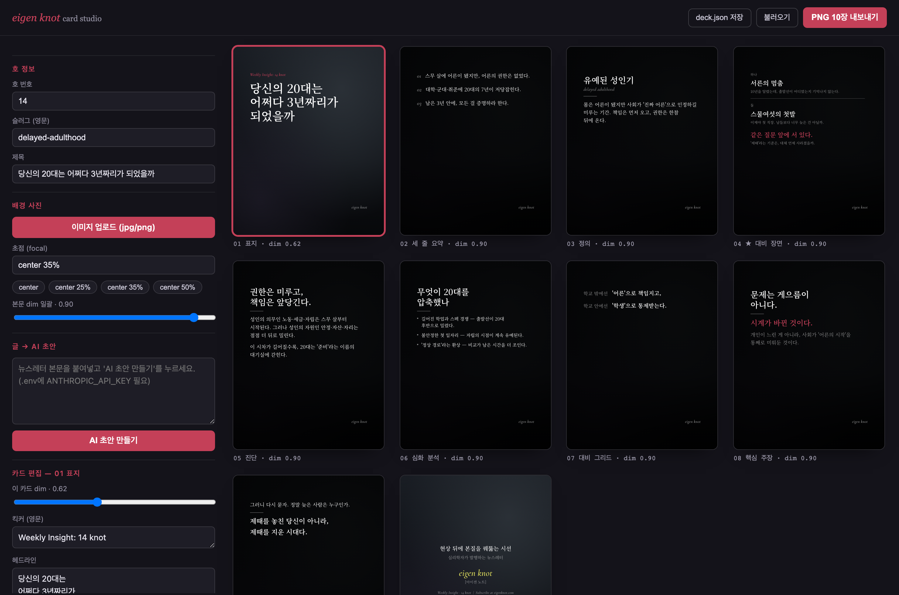
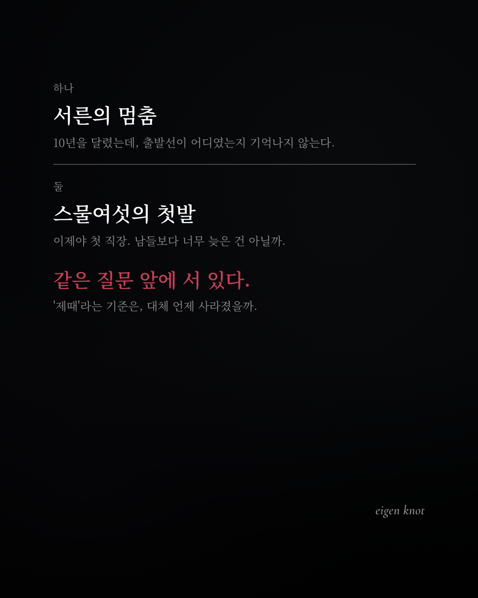
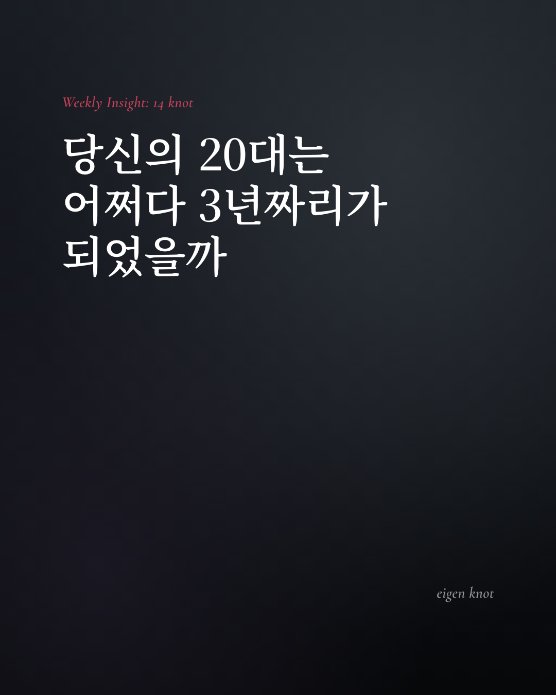
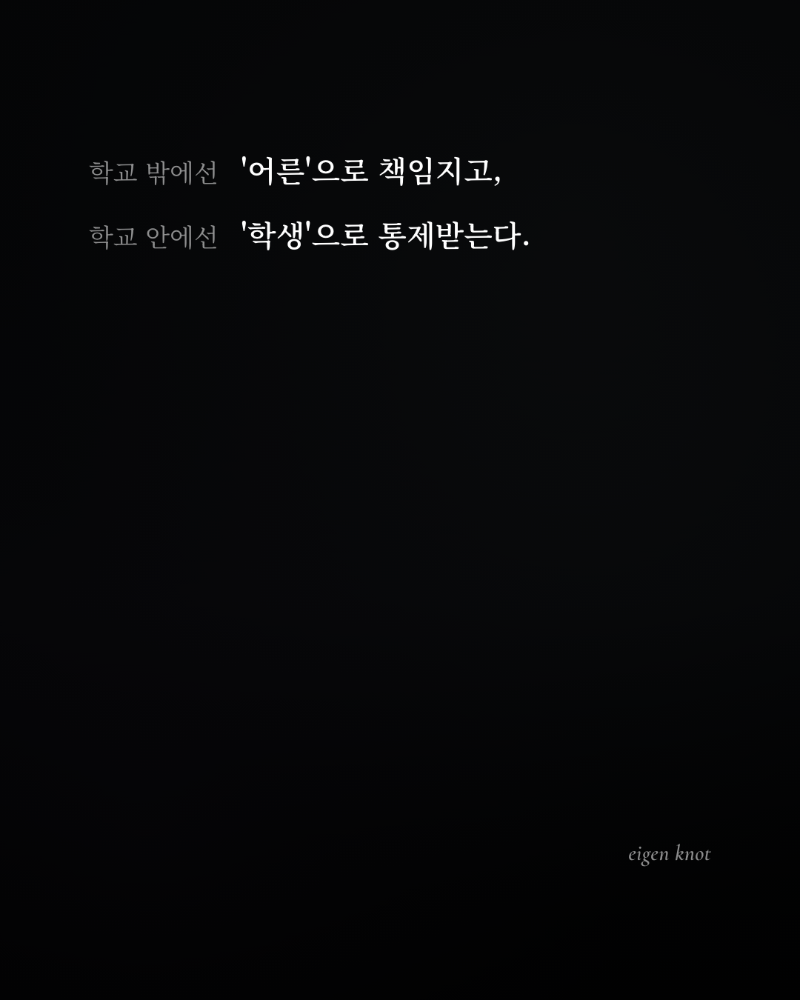
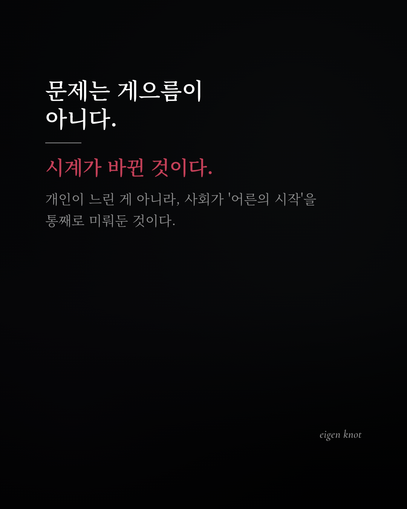

# eigen knot — card news generator

**Turn one newsletter article + one photo into 10 polished Instagram carousel cards (1080×1350 PNG), in one click.**

Cards are rendered in code (React) and captured with a real browser engine (Playwright) — so Korean typography never breaks, backgrounds never drop out, and every issue shares the same visual language. An optional Claude-powered step drafts all 10 cards from your article; you fine-tune them in a web studio before export.

*글 한 편 + 사진 한 장 → 인스타그램 캐러셀용 카드 10장(1080×1350 PNG). 코드로 렌더링하고 실제 브라우저 엔진으로 캡처하므로 한글 타이포가 깨지지 않고, 배경이 누락되지 않으며, 모든 호가 같은 시각 언어를 공유합니다.*

| Studio | Signature contrast card |
|---|---|
|  |  |

| Cover | Grid | Claim |
|---|---|---|
|  |  |  |

```
글 + 사진 + 메타 ──▶ [Claude] 카드 JSON ──▶ [React] 렌더 ──▶ [Playwright] PNG×10 + ZIP
                     (optional AI draft)     (design system)    (pixel-exact capture)
```

## Quick start

```bash
git clone https://github.com/jensenjunseon-arch/eigen-knot && cd eigen-knot
npm install
npx playwright install chromium   # once

npm run sample    # ⚡ no API key needed — renders the bundled sample issue to output/
npm run dev       # 🎛 web studio at http://localhost:5173
```

### Web studio (recommended)

`npm run dev` opens the editing studio:

1. **글 → AI 초안** — paste your article, click once (needs `ANTHROPIC_API_KEY`, see below)
2. **이미지 업로드** — drop in the issue's background photo
3. **카드 클릭 → 인라인 편집** — every field editable; overflow warnings (⚠) flag cards that need trimming
4. **dim 슬라이더** — per-deck and per-card darkness over the photo
5. **PNG 10장 내보내기** — server-side Playwright capture → ZIP download

> The AI output is a *draft*. The 10% of manual polish — trimming a line, darkening a photo, moving an emphasis — is what makes it publishable. The studio is built around that loop.

### CLI

```bash
# AI draft → 10 PNGs + ZIP
export ANTHROPIC_API_KEY=sk-ant-...   # or put it in .env
npm run generate -- \
  --issue 15 --slug my-topic --title "제목" \
  --img photo.jpg --body article.md --model sonnet

# render hand-written/edited content without AI
npm run generate -- --no-ai --deck content.json \
  --img photo.jpg --issue 15 --slug my-topic --title "제목" --focal "center 35%"
```

| flag | description |
|---|---|
| `--issue` `--slug` `--title` | issue metadata (slug must be kebab-case English — it's in filenames) |
| `--img` | background photo (jpg/png/svg) — inlined as dataURL |
| `--body` / `--deck` | article text (AI mode) / content JSON (`--no-ai` mode) |
| `--focal` | `background-position` per photo, e.g. `"center 30%"` |
| `--dim` | uniform body-card dim (cover/closing stay bright) |
| `--scale` | `2` for retina-sharp 2160×2700 output |
| `--model` | `sonnet` (default) · `opus` · `haiku` |

Output: `output/issue-NNN/` → `01-…-cover.png` … `10-…-closing.png` + ZIP + `deck.json` (for re-rendering & history).

## The 10-card narrative arc

cover → 3-line summary → definition → **two-stories (★ the signature contrast card)** → diagnosis → analysis → grid → claim → conclusion couplet → closing. Each card has one fixed role; the AI extracts the matching part of the article. The contrast card pairs two parallel scenes from the piece and lands a single wine-colored line that ties them.

## Design system (enforced in code)

- **Two text tiers only** — `white` / `whiteFaint` — plus `wine` for ≤5 decisive moments per deck and `chartreuse` exactly once (brand self-reference on the closing card)
- **Noto Serif KR** (Korean myeongjo) + **Cormorant Garamond** italic (English accents) — **self-hosted**, so headless capture can never fall back to tofu (□□□)
- 1080×1350 canvas, safe area `top 180/200 · left 120 · right 140`, watermark mirrored inside the corner, `word-break: keep-all` everywhere
- **Dim rhythm**: bright open (0.62) → deep body (0.90) → bright close — cinematic pacing across the swipe

Tokens: [`src/design/tokens.ts`](src/design/tokens.ts) · card layouts: [`src/cards/cards.tsx`](src/cards/cards.tsx)

## Why server-side capture (lessons learned the hard way)

This project exists partly because browser DOM-to-image libraries kept failing:

- ❌ `html-to-image` batch capture → random background dropouts → ✅ Playwright native screenshots
- ❌ CDN fonts at capture time → fallback-font reflow & tofu → ✅ `@fontsource` self-hosting + `document.fonts.ready` gate
- ❌ capturing a scaled preview → 924×540 mystery PNGs → ✅ separate native-size capture page (`?capture=1&i=N`)
- ❌ base64-encoded SVG backgrounds → silently black in headless Chromium → ✅ URL-encoded UTF-8 dataURLs
- ❌ `--` inside an SVG XML comment → invalid XML → black card → ✅ validated sample assets
- ❌ vertical-only overflow checks → horizontally clipped nowrap lines → ✅ both axes gated before every shot

## Project layout

```
src/design/    tokens · self-hosted fonts · base css
src/types.ts   DeckContent schema + CARD_ORDER (roles, dim rhythm, filenames)
src/cards/     CardBase + 10 card components
src/preview/   studio UI (dev) + native capture page
server/        dev API: /api/analyze (Claude) · /api/capture (Playwright)
content/       article → deck JSON (forced tool-use, schema-validated)
capture/       headless capture pipeline
scripts/       generate.mjs CLI
```

## Roadmap

- [x] M1 render engine · M2 capture · M3 AI drafting · M4 editing studio
- [ ] M5 issue history & template reuse
- [ ] Hosted API + GPT Store / custom-GPT integration

## License

[MIT](LICENSE) — use it, fork it, ship your own newsletter cards.
